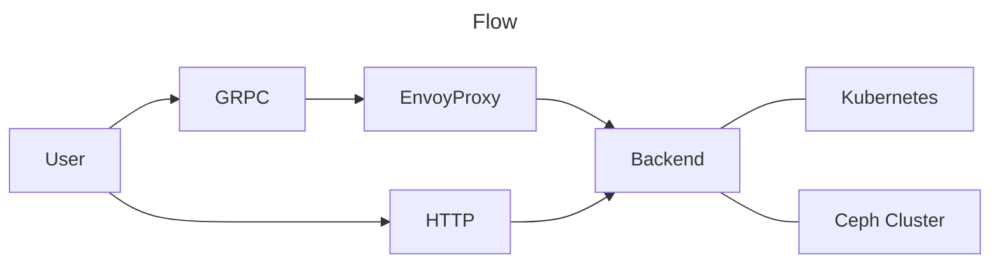

## Technologies

* Protobuf
    * GRPCweb
* Golang
* Quasar
    * Vue

## Architecture

## Points

* Use the Kubernetes API and Ceph Cluster as main sources for the stats and data.
* Connecting to a Prometheus/Alertmanager as a data source in the long term, not short term.
* OAuth2: For the start basic authentication is enough.
