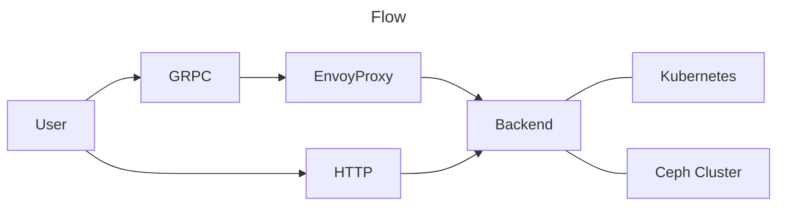

## Technologies

* Backend:
    * Golang
    * Protobuf
    * Gin or similar HTTP server that works for us
* Frontend:
    * Quasar
    * Vue3
    * GRPCweb

## Architecture

* The HTTP server is used to serve the frontend app files, provide the OAuth2/OpenID login endpoints and providing the "app config".
* The GRPC server is used to provide the APIs for, e.g., retrieving/streaming cluster stats, other information about the cluster, and actions that the dashboard will offer.

## Points

* Use the Kubernetes API and Ceph Cluster as main sources for the stats and data.
    * Kubernetes API: Node health, Pods, CephClusters, Logs, etc.
    * Ceph Cluster: Ceph health state, OSD tree, OSD stats, Storage Usages, etc.
* Connecting to a Prometheus/Alertmanager as a data source in the long term, not short term.
* OAuth2/OpenID: For the start basic oauth2 login is enough.
    * Due to nature of OAuth2/OpenID, that process will be using HTTP and not GRPC, though we could potentially get away with using a simple auth proxy in front of "everything" that then passes the user info to the backend in the future.
    * Future expansion: Using oauth2 attributes/userinfo for different roles in the dashboard.

## Pages

### Dashboard

* Cluster Radar
* Key Indicators.
* Overview over Storage Nodes
* Pod Status

### Charts

* IOPS Chart (read/write Ops)
* OSD stats selectable down to per OSD

### Controls aka Cluster Settings

* Two sections: Preferences and Dangerous/Experimental
    * Preferences
        * Ceph Version
        * Nodes to be used for storage (`.spec.storage`)
        * Basic Cluster Options, especially our custom features like Ceph OSD Scrubbing Schedule
        * Cluster notifications
    * Dangerous/Experimental
        * Cluster Auto Update (I would currently consider it as potentially "dangerous" even with the existing and our upcoming health checks and Co.)
