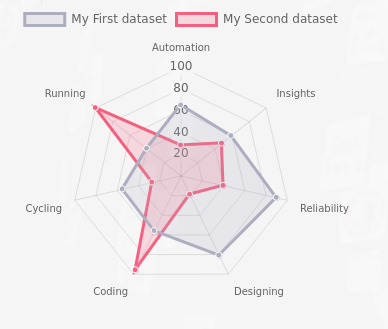

## Idea

A simple way to have a balanced view on the cluster state and its data. Each indicator will be calculated into a percentage from 0% to 100%.

## Key Indicators

* Cluster Health State
    * `HEALTH_OK`: 100%
    * `HEALTH_WARN`: 50%
    * `HEALTH_ERR`: 0%
* Storage Capacity Used
* Nodes: Total Storage Nodes and Healthy Storage Nodes
* Crashes
    * If there are any crashes, we'll try to calculate a percentage based the amount of crashes and on which daemons had the crashes.
* Reliability
    * Check that all daemons (e.g., MDS, RGW) are running with at least 2 replicas, at least 3 MONs.
    * Every storage pool has at least a replicated `size` of 3 and `min_size` of 2.

## Future Expansion

* Being able to compare clusters with each other.
