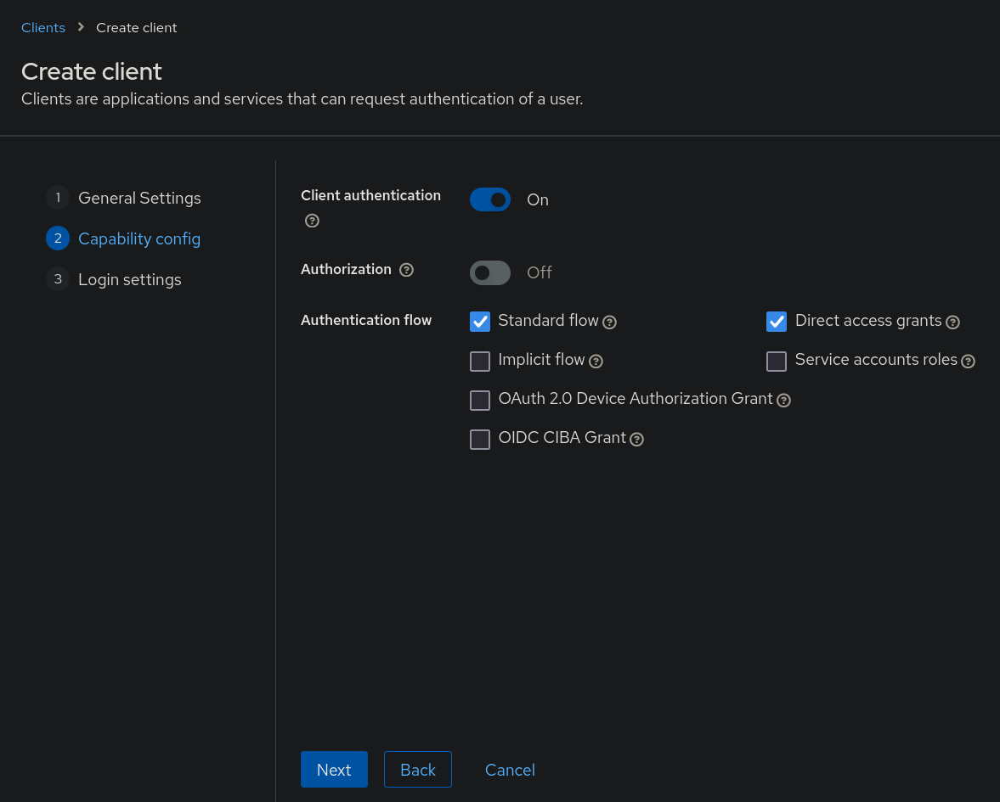

## Keycloak

Tested with Keycloak version `22.0.1`

Assumptions:

* Keycloak Realm Name: `yourrealm`
* Keycloak Base URL: `https://keycloak.example.com/auth`
* data-control-center URL: `https://dcc.example.com`
* OpenID Client ID: `data-control-center`

### 1. Creating OpenID Client

Login to your Keycloak admin control panel. Select `OpenID Connect` as the `Client Type`. `Client ID` can be any valid name, in the example we assume it is called `data-control-center`.


For the capability config enable `Client authentication` and leave everything as is.



Configure the URLs of the data-control-center accordingly, make sure to add the path `/api/oauth2/callback/keycloak` to the valid redirect URIs list.


### 2. Generate Client Credentials

Go to the `Credentials` of the created client in Keycloak, make sure it is set to `Client Id and Secret` and regenerate the `Client Secret` using the `Regenerate` button.


Use the copy button to client secret, it must be set in the config in the provider's `clientSecret:` field.

(We'll use `example-openid-client-secret` as the example client secret for further configuration steps)

### 3. Update data-control-center Configuration

Update the data-control-center config with the following OAuth2 provider entry:

```yaml
# [...]
oauth2:
  providers:
    - name: 'keycloak'
      label: 'Keycloak'
      homepage: 'https://keycloak.example.com'
      type: 'generic'
      redirectURL: 'https://dcc.example.com/api/oauth2/callback/keycloak'
      clientID: 'data-control-center'
      clientSecret: 'example-openid-client-secret'
      scopes:
        - openid
      endpoints:
        authURL: 'https://keycloak.example.com/auth/realms/yourrealm/protocol/openid-connect/auth'
        tokenURL: 'https://keycloak.example.com/auth/realms/yourrealm/protocol/openid-connect/token'
        userInfoURL: 'https://keycloak.example.com/auth/realms/yourrealm/protocol/openid-connect/userinfo'
        logoutURL: 'https://keycloak.example.com/auth/realms/yourrealm/protocol/openid-connect/logout'
      mapping:
        # Map the OpenID `sub` field to be the user ID
        id: "sub"
        # Use Keycloak's `preferred_username` for the user's username
        username: "preferred_username"
# [...]
```

To make sure that the endpoints are correct for your Keycloak instance, go to your Realm's settings and check the `OpenID Endpoint Configuration` in the `Endpoints list` section.


When updating the config via the Helm chart's `values.yaml` the data-control-center should be automatically restarted.
